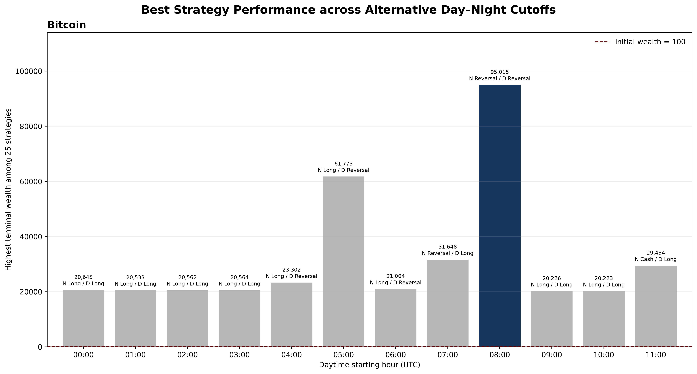
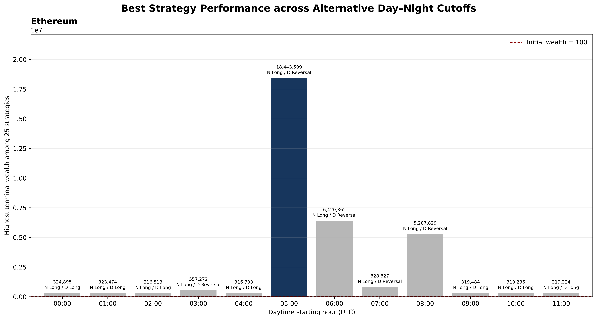
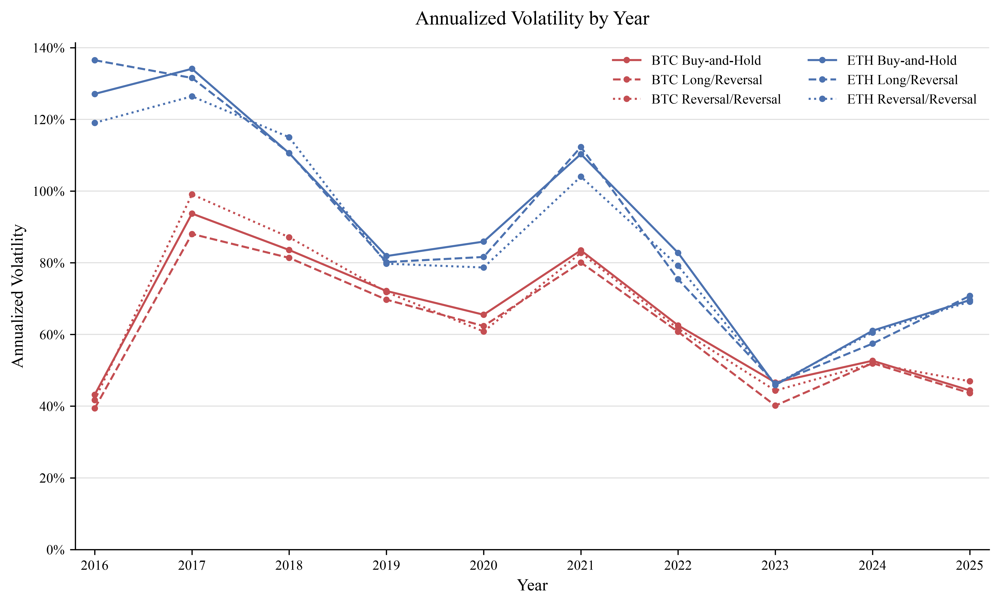
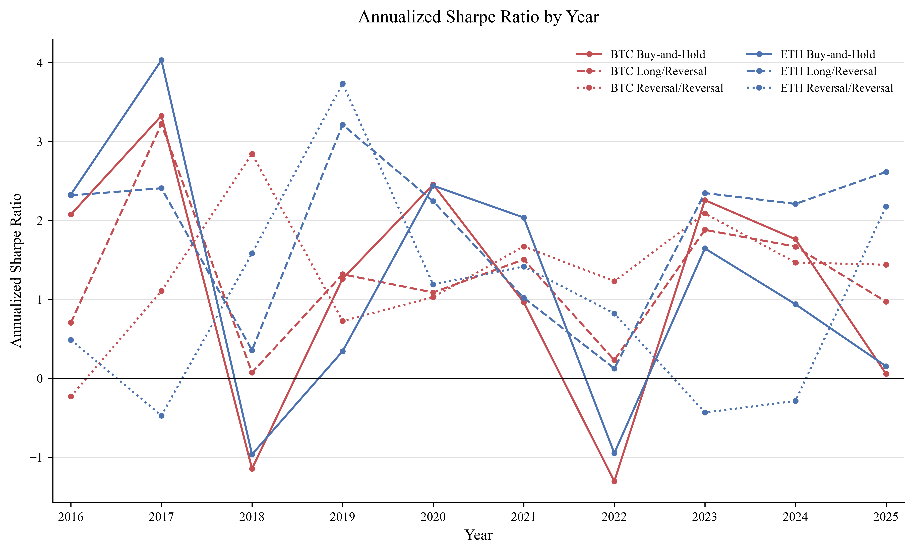
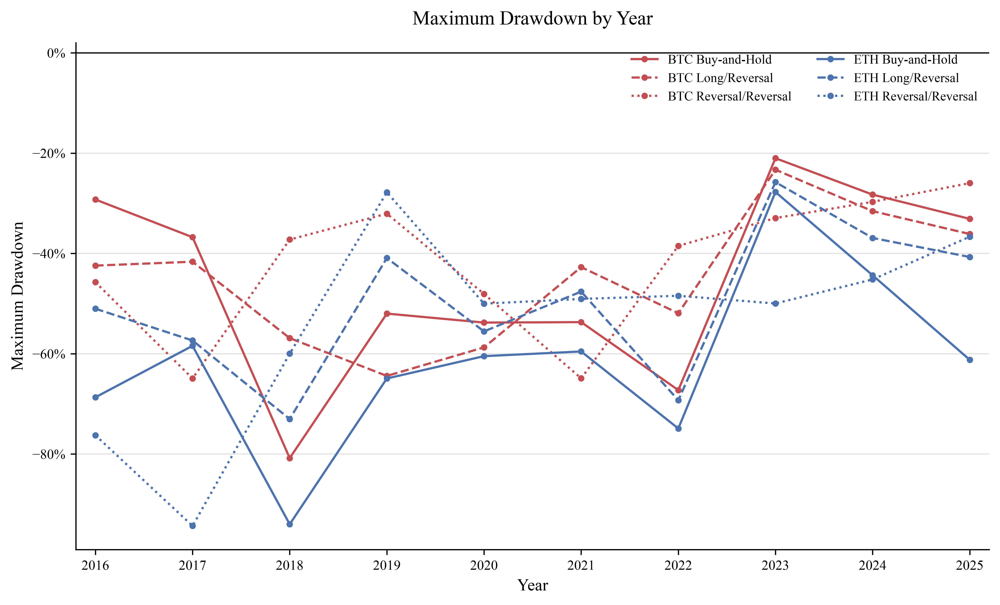

# Crypto-day-night-effects

Replication code and versioned paper outputs for "On the Performance of Lagged Momentum and Reversal Strategies Across Daytime and Overnight Sessions in Bitcoin and Ethereum Cryptocurrencies" (Journal of Risk and Financial Management, 2026).

This repository contains the Python code used to reproduce the analyses and
figures in the manuscript. It also includes the paper figures and machine-readable
result tables generated on August 19, 2026. Notebook files are not required.

## Paper outputs

- [`paper_outputs/figures`](paper_outputs/figures) contains the five PNG figures
  used in the manuscript: the BTC and ETH cutoff comparisons, annualized
  volatility, annualized Sharpe ratios, and maximum drawdowns.
- [`paper_outputs/tables`](paper_outputs/tables) contains the complete strategy
  and cutoff results, annual figure data, statistical-test results, and the 2025
  IBIT/ETHA metrics in CSV format.

The two full strategy files are:

- `btc_eth_all_metrics.csv`: 1,050 rows covering both assets, 25 ordered
  strategies, 0/1/2 bps, and the seven core UTC cutoffs from 04:00 to 10:00.
- `cutoff_strategy_full_results.csv`: 1,800 rows covering both assets, all 25
  ordered strategies, 0/1/2 bps, and all 12 hourly cutoffs examined in the
  cutoff search.

### Figure gallery

**Best BTC strategy by cutoff**



**Best ETH strategy by cutoff**



**Annualized volatility by year**



**Annualized Sharpe ratio by year**



**Maximum drawdown by year**



## Repository contents

| Script | Manuscript output |
| --- | --- |
| `btc_eth_backtest.py` | The 25 ordered BTC/ETH strategy combinations, transaction-cost results, full-sample risk metrics, and subperiod inputs |
| `cutoff_strategy_analysis.py` | The complete 12-cutoff by 25-strategy search and the BTC/ETH cutoff bar charts |
| `statistical_tests.py` | Conditional-predictability tests and preferred-strategy versus buy-and-hold inference |
| `figure_annual_volatility.py` | Annualized volatility by calendar year |
| `figure_annual_sharpe_mdd.py` | Annualized Sharpe ratio and maximum drawdown by calendar year |
| `etf_2025_analysis.py` | The 2025 IBIT and ETHA terminal-wealth and risk-metric tables |

Freshly generated files are written under `outputs/` and are intentionally
excluded from version control. The manuscript copies used for the repository
audit are retained in `paper_outputs/`.

## Data files

Place the following CSV files in a directory named `data_hourly_crypto/` at
the repository root:

- `BTCUSD_1h_2016_2025.csv`
- `ETHUSD_1h_2016_2025.csv`
- `IBIT_1h_2024_07_05_to_2026_07_08.csv`
- `ETHA_1h_2024_07_23_to_2026_07_06.csv`

The BTC and ETH scripts require the columns `open_time`, `timestamp`, and
`close`. The ETF script additionally uses `open`, `high`, `low`, `volume`, and
`adj_close`.

The manuscript identifies Kraken's official historical market-data archive
as the BTC/ETH source. Raw BTC/ETH data are not committed because their
provenance, the treatment of hours with no trades, and redistribution rights
must be independently verified before publication. An older Bitstamp or
third-party file must not be relabeled as Kraken data.

## Environment

Python 3.11 or later is recommended.

```bash
python -m venv .venv
source .venv/bin/activate
python -m pip install -r requirements.txt
```

## Reproduction order

Run the scripts from the repository root:

```bash
python btc_eth_backtest.py
python cutoff_strategy_analysis.py
python statistical_tests.py
python figure_annual_volatility.py
python figure_annual_sharpe_mdd.py
python etf_2025_analysis.py
```

The main backtest must run before the statistical and figure scripts because
they validate their results against `outputs/tables/btc_eth_all_metrics.csv`.

The code retains `trend` as an internal legacy identifier. All manuscript-facing
labels use the term `Momentum`.

## Scope

Experimental timezone tests, altcoin robustness work, superseded IBIT scripts,
spreadsheet-building utilities, notebook backups, caches, temporary PDFs, and
local previews are outside the scope of the manuscript and are not included.
